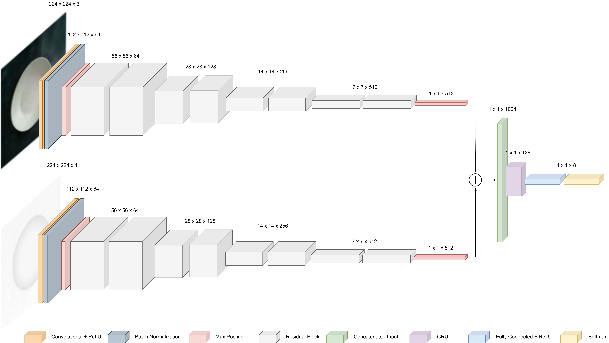

# RGB-D Branched CNN
Branched convolutional neural network classify multimodal images, such as RGB-Depth (RGB-D) images. The fundamental concept underlying the branched approach is the specialization of each branch as a dedicated feature extractor for a single modality, followed by their merge (intermediate fusion) to enable effective classification.



## Setup

- Setup conda environment
```
$ conda env create -f environment.yml
```

- Activate the `"branched-cnn"` conda environment
```
$ conda activate branched-cnn
```

## Train
- Execute the python file `"train.py"`
```
(branched-cnn) $ python train.py --rgb-data <DIR> --depth-data <DIR> --outdir <DIR> --epoch <INT> --lr <FLOAT> --batch <INT>
```
